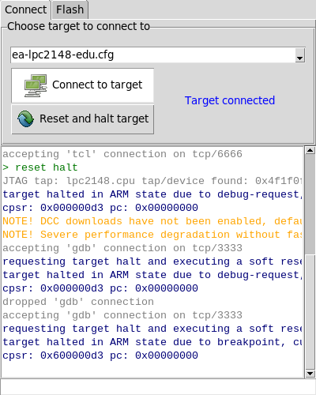
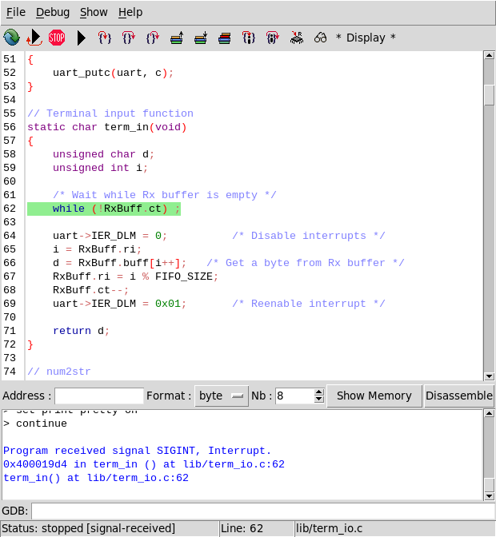

# dbg-ocd-lpc2148

(C) 2014-2021 Eric Boucharé (ebcfr)

## What is it?

It is a sample project for the legacy Embedded Artists LPC2148 education 
board using the dbg and ocd frontends to gdb and openocd

They are simple tools to setup C/asm projects on ARM based microcontroller using
OpenOCD and the arm-none-eabi-gcc/gdb toolchain, away from big IDEs.

The package provides

* [ocd](#ocd) : a simple box to select openocd scripts or custom scripts
* [dbg](#dbg) : a graphical frontend to the gdb debugger
* a [sample NXP LPC2148 project](proj/) to demonstrate the sdk use


## Install

The install targets Linux (debian, ubuntu, raspbian)

* install tcl tk

	```
	sudo apt install tcl tk
	```
	
* install gcc/gdb and openocd

	```
	sudo apt install make binutils-arm-none-eabi gcc-arm-none-eabi gdb-multiarch libnewlib-arm-none-eabi libnewlib-nano-arm-none-eabi
	sudo ln -sf /usr/bin/gdb_multiarch /usr/bin/arm-none-eabi-gdb
	```

	Alternatively, one can use the [ARM embedded toolchain](https://developer.arm.com/tools-and-software/open-source-software/developer-tools/gnu-toolchain/gnu-rm) provided by ARM.
	
* install the sdk

	- system wide 
		
		```
		sudo cp sdk/bin /usr/local/bin/
		sudo cp -r sdk/share/ocd /usr/local/share/
		```
	
	- or local (nothing to do)
	
* edit `proj/setup.sh`
	
	to reflect the sdk install place. The default is set for sdk local use.
	
	```
	#!/bin/sh

	export SDK=$PWD/../sdk
	export PATH=$SDK/bin:$PATH
	```
	
	One may add the path to the compiler bin directory if arm-none-eabi-gcc/gdb 
	and openocd are not in the PATH.


## Quick start

* Open a terminal at the stm32 project root

* Setup the env variable to access tools

	```
	. setup.sh
	```

	(don't forget the '.' and the ' ' in front of setup.sh)

* connect to the board

	```
	ocd &
	```
	
	and choose the the `at91eb01.cfg` script
	
* compile

	```
	make
	```
	It should provide `main.elf` at the root of the project.
	
* load to the target

	```
	dbg main.elf &
	```

	You should be on the first line of the `main` function.
	
* read variable, set breakpoints, step instructions, run the program using icons or through the GDB command line


<a id="ocd"></a>
## About ocd

This is just a helper box to connect to a board using openocd and reset it.
The openocd log is displayed in a window while the entry provides a way to 
interact with openocd directly, which can be useful while testing the 
connection or writing a new connection script.

<p align="center"></p>

The box provides two panes

* a connect pane which allows you to select the target.

	The target list is made of target config files (`.cfg` files) 
	
	* in the `config ` directory in the current directory (so that ocd should be run from the project root directory)
	* in the `~/.ocd/scripts/`. These scripts are copied from $SDK/share/ocd/scripts/ the first time the program is used.
	* in the openocd distribution.
	
	One can set a custom script using definitions in the openocd distribution. Here the example for the `ocd_stm32f411.cfg` script
	
	```
	# get the interface and target in the openocd distribution
	source [find interface/stlink.cfg]
	set CHIPNAME stm32f411
	set WORKAREASIZE 0x20000
	source [find target/stm32f4x.cfg]
	```

	or creating a new one by modifying an existing config file (or from scratch). Example for the AT91EB01 board.
	
	```
	#
	# Embedded Artists LP2148 education board
	#
	# NXP LPC2148 ARM7TDMI-S with 512kB flash (12kB used by bootloader) and 40kB SRAM (8kB for USB DMA), clocked with 12MHz crystal
	
	adapter driver jlink
	
	# parameters:
	# - chip_name - name of the chip, e.g. lpc2103
	# - cputapids - TAP IDs of the core, should be quoted if more than one, e.g. 0x4f1f0f0f or "0x3f0f0f0f 0x4f1f0f0f"
	# - flash_size - size of on-chip flash (available for code, not including the bootloader) in bytes, e.g. 0x8000
	# - flash_variant - "type" of LPC2xxx device, lpc2000_v1 (LPC22xx and older LPC21xx) or lpc2000_v2 (LPC213x, LPC214x, LPC210[123], LPC23xx and LPC24xx)
	# - workarea_size - size of work-area in RAM for flashing procedures, must not exceed the size of RAM available at 0x40000000, e.g. 0x2000
	# - core_freq_khz - frequency of core in kHz during flashing, usually equal to connected crystal or internal oscillator, e.g. 12000
	# - adapter_freq_khz - frequency of debug adapter in kHz, should be 8x slower than core_freq_khz, e.g. 1000
	
	set chip_name lpc2148
	set cputapids "0x3f0f0f0f 0x4f1f0f0f"
	set flash_size 0x7d000
	set flash_variant lpc2000_v2
	set workarea_size 0x8000
	set core_freq_khz 12000
	set adapter_freq_khz 1500
	
	if { [info exists ENDIAN] } {
	   set  _ENDIAN $ENDIAN
	} else {
	   set  _ENDIAN little
	}
	
	reset_config trst_and_srst
	
	# reset delays
	adapter srst delay 100
	jtag_ntrst_delay 100
	
	adapter speed $adapter_freq_khz
	
	foreach i $cputapids {
		append expected_ids "-expected-id " $i " "
	}
	
	eval "jtag newtap $chip_name cpu -irlen 4 -ircapture 0x1 -irmask 0xf $expected_ids"
	
	global _TARGETNAME
	set _TARGETNAME $chip_name.cpu
	target create $_TARGETNAME arm7tdmi -chain-position $_TARGETNAME
	
	$_TARGETNAME configure -work-area-phys 0x40000000 -work-area-size $workarea_size -work-area-backup 0
	
	if { $flash_size > 0 } {
		# flash bank <name> lpc2000 <base> <size> 0 0 <target#> <variant> <clock> [calc checksum]
		set _FLASHNAME $chip_name.flash
		flash bank $_FLASHNAME lpc2000 0x0 $flash_size 0 0 $_TARGETNAME $flash_variant $core_freq_khz calc_checksum
	}
	
	$_TARGETNAME configure -event reset-init {
		# Force target into ARM state
		arm core_state arm
	
		# Do not remap 0x0000-0x0020 to anything but the flash (i.e. select
		# "User Flash Mode" where interrupt vectors are _not_ remapped,
		# and reside in flash instead).
		#
		# See section 7.1 on page 32 ("Memory Mapping control register") in
		# "UM10139: Volume 1: LPC214x User Manual", Rev. 02 -- 25 July 2006.
		# http://www.standardics.nxp.com/support/documents/microcontrollers/pdf/user.manual.lpc2141.lpc2142.lpc2144.lpc2146.lpc2148.pdf
		mwb 0xE01FC040 0x01
	}
	
	#$_TARGETNAME configure -event reset-end {
	#	soft_reset_halt
	#	mww 0xE01FC040 2
	#	mww 0xE01FC0C4 0x801817BE
	#}
	```
	
	At connection, the config file, the selected file is copied in 
	`~/.ocd/scripts/` with a starting '_', which allow you to get easily the 
	config files from the openocd distrib, rename and modify the initial script 
	for our own use. Selected files are remembered when ocd is terminated.
	
	The `Reset and halt target` button, a `cpu_reset_halt` generates a `reset halt` 
	command. If the microcontroller doesn't halt, the configuration script should
	provide the `reset-end` hook to help the microprocessor halting.
	
	```
	$_TARGETNAME configure -event reset-end {
		
	}
	```
	
* a flash pane, which should allow you to flash a file to be selected to the microcontroller through openocd (not needed for the STM32 project).


<a id="dbg"></a>
## About dbg

It's a graphical frontend to the gdb debugger. The program can actually be 
used to debug standard or microcontroller programs. 

<p align="center"></p>

It uses a config file named `.dbginit` (hidden file) which have to be at the 
root of the project. For example, for the LPC2148 project, we have

```
#! arm-none-eabi-gdb
target extended-remote localhost:3333
monitor soft_reset_halt
# set external flash @0x01000000
monitor mww 0xffe00000 0x01002535
# set external SRAM @0x02000000
monitor mww 0xffe00004 0x02002121
# set MCR register
monitor mww 0xffe00024 0x00000006
# disable all interrupts
mww 0xFFFFF124 0xFFFFFFFF
# change the mapping!
monitor mww 0xffe00020 1
# upload the code/data to the taget
load
tb main
continue
```

The first line, starting with `#!` tells us about the debugger used (which 
must be in the PATH).

The second line allows to pre-add to the file menu some source file, to be 
able to setup breakpoints for example. When debugging, new entered files are 
appended to the file menu.

The remainder are just standard gdb commands, here just to say how to connect
to openocd (port 3333), to download the code to the target flash memory and to
setup break point on the main function so that we get started from here (and 
all the pre-main initialization code will be executed).

The program is aimed to ease the use of gdb, not replace it. So it doesn't do 
what gdb does perfectly well.

One can use [gdb commands](proj/docs/refcard.pdf) as usual.

```
# print a register in decimal/hexa/binary
print $r0
p $r0
p/x $r0
p/t $r0
p $pc

# same for variables
p/x myvar

# control execution
step
continue
# ^C to halt the program
```

One can toggle breakpoints easily by double-click on the line.

Peripheral registers can be accessed through their pointer which have a '_' 
prefix. Names follow the conventions established by the microcontroller 
datasheet.

```
p/x *_GPIOA
p/x _GPIOA->MODER
```

Finally, the program uses the same shortcuts than Eclipse does (F5=step into,
F6=step over, F7=Finnish, F8=continue).
