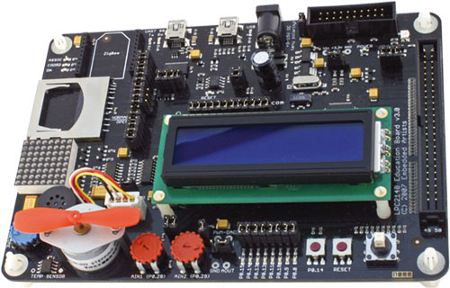

# NXP LPC2148 Sample project

* [About the sample project](#about)
* [Configuration](#cfg)
* [Building and running the project](#run)

<a id="about"></a>
## About the sample project

### The target

The project uses the legacy Embedded Artists LPC2148 board with a NXP LPC2148 microcontroller (arm7tdmi microprocessor Xtal@ 12 MHz, PLL up to 60 MHz) and 512kb Flash and 32kb + 8kb SRAM. It requires a JLINK JTAG probe (I have a JLINK EDU probe).

<p align="center"></p>

The project allows you to upload the program in SRAM (default), also in Flash.

### Project tree

```
 +- config/            linker script, openocd script
 +- docs/              some doc
 +- include/
 |   +- board.h        global peripheral pointers
 |   +- lpc214x.h      peripheral register structure definition
 +- lib/               microcontroller peripheral drivers
 +- src/               Application src
 +- startup/           Startup code ()
 +- Makefile
 +- README.md
```

<a id="cfg"></a>
## Project configuration (if needed)

The project is managed by a Makefile. The developper needs only to focus on
the first part of the Makefile.


 
<a id="run"></a>
## Build and run the project

### Connecting to the board

	ocd &
	
then choose the ea_lpc2148-edu.cfg target in the list.

### Building the project:

	make

will produce the executable `main.elf`, a mapping file `main.elf.map` and object files in the different directories where there is source code.

### Cleaning the project:

	make clean

### Uploading the program to the microcontroller:

	dbg main.elf &

uploads the program to the microcontroller FLASH memory, and 
executes the code up to the entry `main()` function.

`dbg` has a restart feature (see second icon from the left) which enable to
restart the program without re-flashing (interesting while debugging).

`dbg` has an autreload feature that tracks for executable change. If on, it 
reloads automatically the new executable so that you don't need to relaunch
it each time.

	# query autoreload
	set autoreload
	
	# set autoreload
	set autoreload 1
	
	# unset autoreload
	set autoreload 0

A serial terminal is required to test USART example 5

A few options are

* `gtkterm`

	```
	sudo apt install gtkterm
	gtkterm
	```
	
	then configure the port `/dev/USB0`, the speed 115200 bauds, 8 bits, no parity, 1 stop bit

* GNU screen

	```
	sudo apt install screen

	screen /dev/ttyUSB0 115200

	# Enable the CTS/RTS handshake
	screen /dev/ttyUSB0 115200,ctsrts

	# Close the screen after you finish the debugging session
	--> Ctrl a + k

	# View your serial port status (CTS/RTS/DTS/PE/RI..etc)
	--> Ctrl a + i
	
	# clear the buffer : Ctl a + C
	# enter command    : Ctl a + :
  		- clear : clear the buffer
	```


## Uploading the program to Flash

To upload the program to Flash, you'll have to 

* update the .dbginit loading script

	```
	cp config/dbg_init_flash .dbginit
	```
	
* update the Makefile script


	```
	make clean
	cp config/Makefile_flash Makefile
	make
	dbg main.elf
	```
	